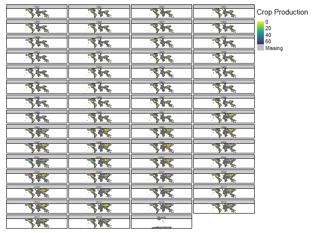

# Loading the packages used

##trying out the tmap package for the first time

```r
library(tidyverse)
```

```
## -- Attaching packages --------------------------------------- tidyverse 1.3.1 --
```

```
## v ggplot2 3.3.5     v purrr   0.3.4
## v tibble  3.1.4     v dplyr   1.0.7
## v tidyr   1.1.3     v stringr 1.4.0
## v readr   2.0.1     v forcats 0.5.1
```

```
## -- Conflicts ------------------------------------------ tidyverse_conflicts() --
## x dplyr::filter() masks stats::filter()
## x dplyr::lag()    masks stats::lag()
```

```r
library(janitor)
```

```
## 
## Attaching package: 'janitor'
```

```
## The following objects are masked from 'package:stats':
## 
##     chisq.test, fisher.test
```

```r
library(here)
```

```
## here() starts at C:/Derek/UofM/Fall_2021/Data Science_R/Labs/Week-10_tidy-tuesday-assignment
```

```r
library(viridis)
```

```
## Loading required package: viridisLite
```

```r
library(lubridate)
```

```
## 
## Attaching package: 'lubridate'
```

```
## The following objects are masked from 'package:base':
## 
##     date, intersect, setdiff, union
```

```r
library(tidytuesdayR)
```

```
## Warning: package 'tidytuesdayR' was built under R version 4.1.2
```

```r
library(tmap)
```

```
## Warning: package 'tmap' was built under R version 4.1.2
```

```r
library(sf)
```

```
## Linking to GEOS 3.9.1, GDAL 3.2.1, PROJ 7.2.1
```

```r
library(spData)
```

```
## Warning: package 'spData' was built under R version 4.1.2
```

```
## To access larger datasets in this package, install the spDataLarge
## package with: `install.packages('spDataLarge',
## repos='https://nowosad.github.io/drat/', type='source')`
```

```r
library(magick)
```

```
## Warning: package 'magick' was built under R version 4.1.2
```

```
## Linking to ImageMagick 6.9.12.3
## Enabled features: cairo, freetype, fftw, ghostscript, heic, lcms, pango, raw, rsvg, webp
## Disabled features: fontconfig, x11
```

```r
library(gifski)
```

```
## Warning: package 'gifski' was built under R version 4.1.2
```


# Loading the data directly from the tidy tuedsay directory

```r
tuesdata <- tidytuesdayR::tt_load(2020, week = 36)
```

```
## --- Compiling #TidyTuesday Information for 2020-09-01 ----
```

```
## --- There are 5 files available ---
```

```
## --- Starting Download ---
```

```
## 
## 	Downloading file 1 of 5: `arable_land_pin.csv`
## 	Downloading file 2 of 5: `cereal_crop_yield_vs_fertilizer_application.csv`
## 	Downloading file 3 of 5: `cereal_yields_vs_tractor_inputs_in_agriculture.csv`
## 	Downloading file 4 of 5: `key_crop_yields.csv`
## 	Downloading file 5 of 5: `land_use_vs_yield_change_in_cereal_production.csv`
```

```
## --- Download complete ---
```

```r
key_crop_yields <- tuesdata$key_crop_yields%>%
  clean_names()
```

# Pivoting the data to a long table format and changed the "code" column to "iso_a3" to match with the world data for joining


```r
long_crops <- key_crop_yields %>% 
  pivot_longer(cols = 4:last_col(),
               names_to = "crop", 
               values_to = "crop_production") %>% 
  mutate(crop = str_remove_all(crop, " \\(tonnes per hectare\\)")) %>% 
  set_names(nm = names(.) %>% tolower())
  
long_crops<-mutate(long_crops, iso_a3=code)


long_crops
```

```
## # A tibble: 143,825 x 6
##    entity      code   year crop                           crop_production iso_a3
##    <chr>       <chr> <dbl> <chr>                                    <dbl> <chr> 
##  1 Afghanistan AFG    1961 wheat_tonnes_per_hectare                  1.02 AFG   
##  2 Afghanistan AFG    1961 rice_tonnes_per_hectare                   1.52 AFG   
##  3 Afghanistan AFG    1961 maize_tonnes_per_hectare                  1.4  AFG   
##  4 Afghanistan AFG    1961 soybeans_tonnes_per_hectare              NA    AFG   
##  5 Afghanistan AFG    1961 potatoes_tonnes_per_hectare               8.67 AFG   
##  6 Afghanistan AFG    1961 beans_tonnes_per_hectare                 NA    AFG   
##  7 Afghanistan AFG    1961 peas_tonnes_per_hectare                  NA    AFG   
##  8 Afghanistan AFG    1961 cassava_tonnes_per_hectare               NA    AFG   
##  9 Afghanistan AFG    1961 barley_tonnes_per_hectare                 1.08 AFG   
## 10 Afghanistan AFG    1961 cocoa_beans_tonnes_per_hectare           NA    AFG   
## # ... with 143,815 more rows
```

# Ran this code to tell the package i want to plot the GIF and not just to view it

```r
tmap_mode("plot")
```

```
## tmap mode set to plotting
```

```r
data(World)
```
# Merged the crop data to the world data i got from the tmap package and converted it into sf format

```r
map <- merge(long_crops, World[, c(5, 1)], by = "iso_a3", all.y = TRUE)

map <- st_as_sf(map)
```


# Tried to make a facet map, but there were too many years and countries for the facet to be legible, so opted for the animation


```r
tm_shape(map) +
  tm_polygons(
    col = "crop_production",
    style = "cont",
    pal = viridis(10, direction = -1),
    title = "Crop Production"
    ) +
  tm_facets(by = "year", ncol = 4) +
  tm_layout(legend.outside.size = 0.2)
```

<!-- -->

# ran the this code to get the style guides and color pallates for tmap, which downloads .jpegs of the color pallets and saves them in the project directory

```r
#tmap_style_catalogue(path = "./tmap_style_previews", styles = NA)

#tmap_style_catalog(path = "./tmap_style_previews", styles = NA)
```

# ran the animation, but tmap isn't as intuitive as the ggplot package.  Had issues with adjusting the titles and legends, but was able to export as a gif!


```r
animation <- tm_shape(map)+
  tm_polygons(
     col = "crop_production",
      style = "cont",
     pal = viridis(10, direction = -1)) +
  tm_facets(along = "year") +
  tm_layout(legend.position = c("left", "bottom"))
  
  tmap_animation(
    animation, filename = "map.gif",
    delay = 75, width = 1200, height = 600, 
    )
```

```
## Creating frames
```

```
## ===
```

```
## =
```

```
## =
```

```
## ==
```

```
## =
```

```
## =
```

```
## ==
```

```
## =
```

```
## ==
```

```
## =
```

```
## =
```

```
## ==
```

```
## =
```

```
## =
```

```
## ==
```

```
## =
```

```
## =
```

```
## ==
```

```
## =
```

```
## =
```

```
## ==
```

```
## =
```

```
## ==
```

```
## =
```

```
## =
```

```
## ==
```

```
## =
```

```
## =
```

```
## ==
```

```
## =
```

```
## =
```

```
## ==
```

```
## =
```

```
## =
```

```
## ==
```

```
## =
```

```
## ==
```

```
## =
```

```
## =
```

```
## ==
```

```
## =
```

```
## =
```

```
## ==
```

```
## =
```

```
## =
```

```
## ==
```

```
## =
```

```
## =
```

```
## ==
```

```
## =
```

```
## ==
```

```
## =
```

```
## =
```

```
## ==
```

```
## =
```

```
## =
```

```
## ==
```

```
## =
```

```
## 
## Creating animation
## Animation saved to C:\Derek\UofM\Fall_2021\Data Science_R\Labs\Week-10_tidy-tuesday-assignment\rmarkdown\map.gif
```


